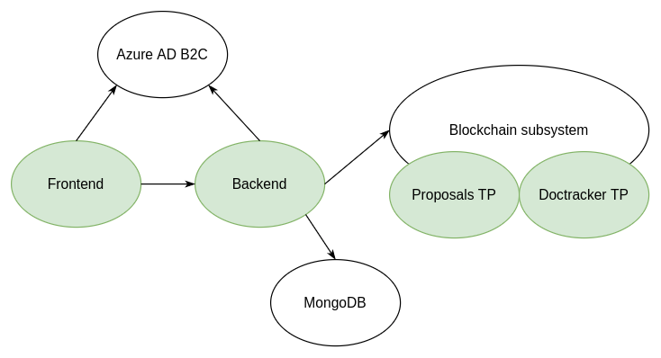
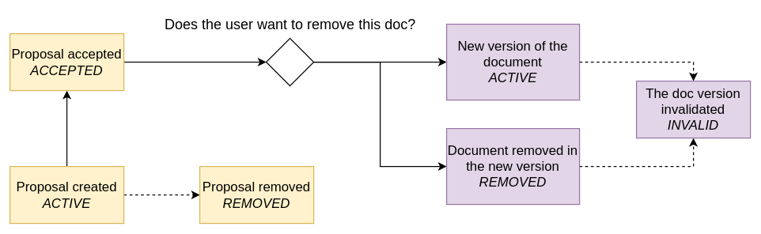
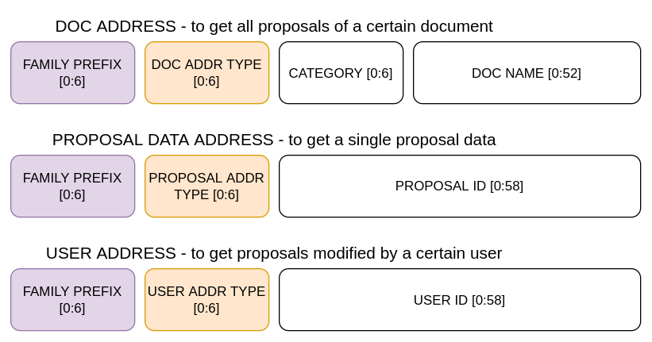
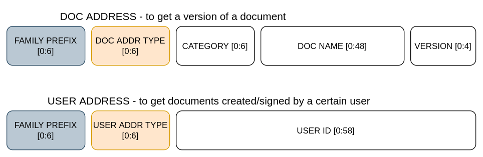

# Organizational Documents Management using Blockchain technology

Each organization needs a way to store and update its documents.
And in the organization world, new documents usually have to
be reviewed and signed by its members, before they get accepted.

This application serves as a backend of a system managing documents.
It focuses on two main concepts: proposals and documents. 

A document is an accepted version of a proposal. A document can come in several versions,
each might be created by a different person. It is uniquely identified by its name and category.
A user can't create the document directly, only through a proposal and the signing process.

A proposal however can be created by anyone. It needs to include the document name it refers to.
If the document already exists, when the proposal is accepted,
it is added under the same name and category with the next version number.

## Blockchain

By using the blockchain technology an organization can make sure that nobody can
modify the existing documents - change their content, remove, etc.

Submitted documents have their content stored in the off-chain database and then
their document related information together with the content hash are submitted to the blockchain.

The application uses the Hyperledger Sawtooth technology. The blockchain needs to be run with the two Transaction Families: Proposals TF and DocTracker TF, actively processing the requests. They store separately document proposals and accepted documents and operate on them. 

## Authorization

Each request require the authorization token with a corresponding scope. Scopes are:
`docs.read`, `docs.write` and `docs.sign`. The tokens should be generated by the Azure AD B2C service on user login.

## User management

The organization users are managed by the external service Azure AD B2C by administrators. The application retrieves the user data from this service using its client credentials. Also updates them with generated public and private keys if missing, which are used to sign the blockchain transactions.

# How to run?

## Azure AD B2C tenant

 - application registered
 - exposed APIs
     - docs.read
     - docs.write
     - docs.sign
 - API permissions
     - Microsoft Graph: `User.ReadWrite.All`
 - client secret created
 - created the application user account

## Environment

```
cp .env.example .env
```
Adjust the environment variables, especially these related to Azure service (prepended with MS_).
Use the user ID of the application account in APP_USER_ID.

Make sure that the PORT number is set.

## Blockchain 

The application requires running blockchain system, as it subscribes to the blockchain events on the start.

    - validator and the components needed by it
    - validator REST API
    - Proposals TP
    - DocTracker TP
    - Settings TP

## Running in a container

Prerequisites:
 - Docker

When the previous steps are done, it's finally time to run the dockerized application.

The port mapped to the host below is default and should be replaced with the one defined in the .env file (PORT).

```
docker build -t backend . && \
docker run -p 8077:8077 backend
```

## Running locally

Optionally for local usage the application can be used outside of docker container.

Prerequisites:
 - Go installed
 - libraries
    ```
    apt update && apt install -y libssl-dev libzmq3-dev
    ```

Run the application with
```
go run cmd/main.go
```

# Architecture



This is the backend application of the system. 

## Data

The data model resides in the directory internal/model/ and consists of the following models:
- proposal
- document
- user

A proposal and a document are subjects to the state transition.



The content of documents is stored in the off-chain DB, MongoDB.
All the other document related information is saved on the blockchain.

## HTTP server

### Served requests

PUT `/api/proposals/{docName}` - create a new proposal  

POST `/api/proposals/{proposalID}` - sign a proposal  

GET `/api/proposals` - get proposals  
GET `/api/docs` - get accepted documents by author/signer  
GET `/api/docs/{category}/{docName}` - get documents by their name & category  

GET `/health` - healthcheck  

### Middleware

Each request needs an authorization token. The token is validated by the auth middleware. Apart from that, the middleware stores the  userID and the scopes information in the request context.

To disable the CORS policy for this application, the cors middleware is used.

## Blockchain

Communication with the blockchain is done via HTTP requests sent to the validator's REST API service. When submitting new proposals, the author's keys are used to sign the transaction. When submitting a new accepted document, the application's keys are used. Currently anyone with the valid access token can submit a new transaction, no roles/permissions checks are executed. 

Apart from the communication initialized by a user, the app actively listens to the events generated by the blockchain. On the reception of event "proposal_accepted", the proposal is submitted to the DocTracker family by the application.

### Addresses

To allow quering the data, each TF supports more address types inside its family. On the pictures below, each address part is its corresponding data hashed by SHA512 algorithm.

- Proposals TF



- DocTracker TF



# Directory structure
```
.  
├── cmd              # Main function of the application
├── doc              # Documentation related files
└── internal
    ├── app            # Main application handlers, application logic
    ├── blockchain     # Blockchain communication
    ├── config         # Configuration
    ├── hashing        # Hash functions
    ├── model          # Data models
    ├── ports          # Input to the 
    |   └── http       # HTTP server, handlers and middleware
    ├── repository     # Database communication
    ├── signkeys       # Generation of signing keys
    └── usermanager    # Communication with Azure AD B2C
```
